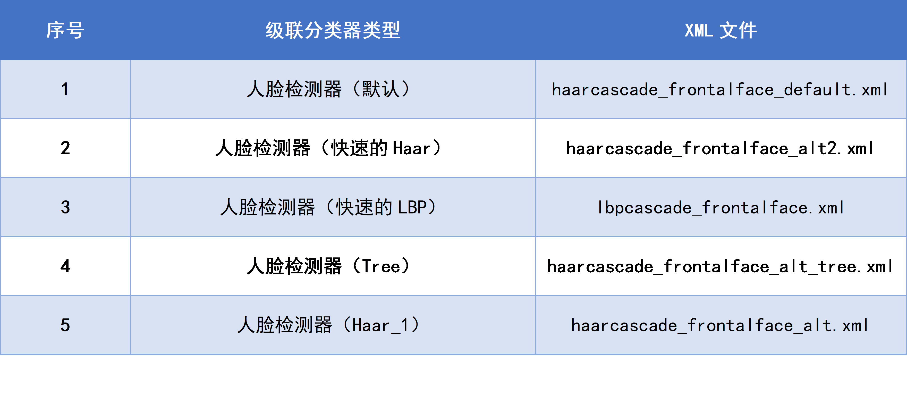
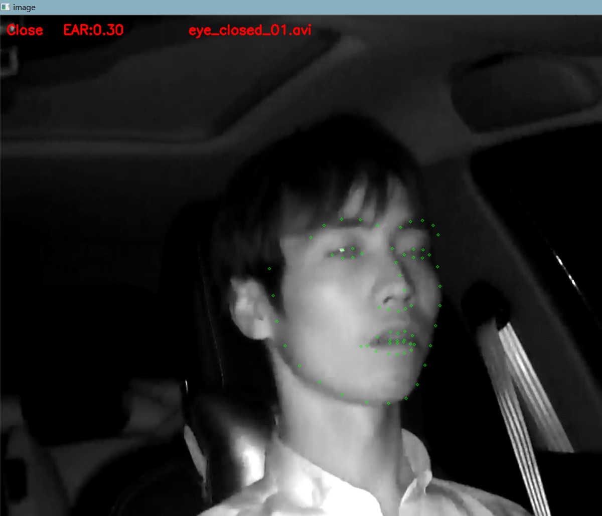
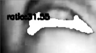

# Fatigue-Detection
### Detect the drivers fatigue real-time using python and OpenCV

This project is my final homework of the course Digital Image Processing. I use the OpenCV and python 3.6 to realize 4 different aspects for the problem of drivers' fatigue real-time detection.

## Dependencies
+ python 3.6
+ OpenCV 3.3.1
+ dlib
+ imutils
  
## **A** --- Eye Closed Detect
### Step 1: 视频读取
使用OpenCV库自带的VideoCapture类可以实现对视频每一帧的读取以及视频大小、长宽信息的读取。
### Step 2: 人脸检测

要检测眼睛闭合首先要检测出图像中的人脸。检测人脸目前开源的效果比较的python库有dlib库和OpenCV自带的人脸检测器。

### Step 3: 人脸特征点检测
dlib数据库提供了训练好的人脸68点特征点检测器，并且都有固定的标号

### Step 4: 人眼闭合检测
参考Tereza Soukupova和Jan ´ Cech的论文[6]，其中提出了眼睛纵横比的概念——eye aspect ratio (EAR)。通过计算这个值，可以判断图像中的人眼是张开还是闭合。论文中给出的EAR的定义如下：

### Result

  
## **B** --- Mouth Closed Detect
第一想法是与Part1人眼的检测定位方法类似，都是先人脸检测然后用特征点检测找到嘴巴的位置。然而直接使用有一些问题，由于这个数据集中人脸的朝向都比较偏，打哈欠时面部变形也比较严重，导致直接用正面人脸检测比较困难。

OpenCV中有训练好的侧脸识别分类器，因此检测思路是先用正脸检测器检测，然后如果没有检测出人脸，则再用侧脸检测器检测一遍。用这种方法相比单用dlib库或者OpenCV正脸检测器，可以大大提高人脸检测率。这里要注意的是OpenCV中的侧脸分类器是针对左脸训练的，由于车内摄像头安装在车内右侧所以大部分的人脸都是右脸部分较多。所以需要将图像做个垂直镜像后再送入分类器识别人脸。

像A一样使用68点人脸特征点检测会出现一些问题。由于张大嘴时人脸的另一半部分被遮挡的较为严重，因此人脸特征点检测经常会出现严重的漂移（检测器将鼻孔识别为眼睛）。所以要考虑使用别的方法检测嘴部。

我使用的方法的核心是利用OpenCV的寻找轮廓函数——findContours。第一步先根据人脸检测框定位嘴部位置。为了消除光照不均的影响，所以第二步对嘴部区域图像做一个直方图均衡。寻找轮廓更适合对二值图像使用，所以之后设定一个阈值对图像进行二值处理。

经过处理的图像如下图所示，可以看到嘴部内部的轮廓已经被找到。通过统计这部分轮廓的面积与嘴部区域面积之比，即可判断嘴巴是张还是合。

&emsp;&emsp;

## **C** --- Calling Detect
这部分内容我的思路是先找到人左右耳附近的区域，然后检测人手是否在耳朵附近。人脸检测的方法与Part2一样，即一个正面人脸检测器与侧面人脸检测器级联。

由于摄像头的位置不在正面，所以根据左手或者右手拿起手机的不同，检测框的位置也有所不同。如下两张图所示是右手拿起手机的示意图，手背位置朝向摄像头，手的位置也较高。

## **D** --- Looking Around Detect
这个实现思路比较简单，但是效果确非常好。使用OpenCV的正脸检测器，检测图像中是否有正脸存在，若检测到正脸，说明驾驶者的脸朝向前方。若没有检测到，则说明驾驶者的脸偏向了旁边。

这种方案的缺陷是无法定性地判断驾驶者的脸偏向哪个方向，以及偏离的角度。但是作为初步判断驾驶者是否看向了旁边是很有效的方法。

